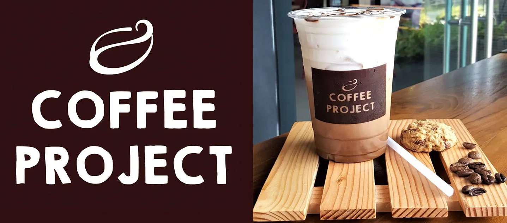

<a name="readme-top">

<br/>

<br />
<div align="center">
  <a href="https://github.com/DS-runaway/">
  <!-- TODO: If you want to add logo or banner you can add it here -->
    
  </a>
<!-- TODO: Change Title to the name of the title of your Project -->
  <h3 align="center">Final Project - Coffee Shop </h3>
</div>
<!-- TODO: Make a short description -->
<div align="center">
  A website dedicated to an exisiting coffee shop brand under the name, Coffee Project, with the help of Bootstrap and in accordance with the final requirements for the CSS0027L course.
</div>

<br />

Wakatime Progress before folder name change (As of November 21, 2024):

[](https://wakatime.com/badge/user/8212635a-c5cf-42a7-911f-f344a63e7019/project/dbfcf697-7f58-4ff3-b9ff-4fc44ce59a19)

Wakatime Progress after folder name change (As of November 29, 2024):


<!-- TODO: Change the zyx-0314 into your github username  -->
<!-- TODO: Change the WD-Template-Project into the same name of your folder -->


---

<br />
<br />

<!-- TODO: If you want to add more layers for your readme -->
<details>
  <summary>Table of Contents</summary>
  <ol>
    <li>
      <a href="#overview">Overview</a>
      <ol>
        <li>
          <a href="#key-components">Key Components</a>
        </li>
        <li>
          <a href="#technology">Technology</a>
        </li>
      </ol>
    </li>
    <li>
      <a href="#rule,-practices-and-principles">Rules, Practices and Principles</a>
    </li>
    <li>
      <a href="#resources">Resources</a>
    </li>
  </ol>
</details>

---

## Overview

<!-- TODO: To be changed -->
<!-- The following are just sample -->
Description of the project in details.

Guiding Question:
- What is the project?
    <p>The project is to make a working responsive website using Bootstrap or Tailwind based on the prompt given to the student's respective group.</p>
- Whats the purpose?
    <p>The purpose of this project is to learn and get oneself familiar with coding and designing a website using libraries with HTML.</p>
- What are key components?
    <p>This website's key components are multipage website, Bootstrap features, and responsive attributes for PC and tablet devices as listed below.</p>
- What technology used and how it is used?
    <p>This website's used technologies are HTML, CSS and JS as listed below.</p>

### Key Components
<!-- TODO: List of Key Components -->
<!-- The following are just sample -->
- MultiPage Website
- Embedded with Bootstrap Features
- Added Responsiveness for PC and Tablet Devices

### Technology
<!-- TODO: List of Technology Used -->


## Rules, Practices and Principles
1. Always use `WD-` in the front of the Title of the Project for the Subject followed by your custom naming.
2. Do not rename any .html files; always use `index.html` as the filename.
3. Place Files in their respective folders.
4. All file naming are in camel case.
   - Camel case is naming format where there is no white space in separation of each words, the first word is in all lower case while the succeding words first letter are in upper followed by lower cased letters.
   - ex.: buttonAnimatedStyle.css
5. Use only `External CSS`.
6. Renaming of Pages folder names are a must, and relates to what it is doing or data it holding.
7. File Structure to follow below.

```
WD-ProjectName
└─ assets
|   └─ css
|   |   └─ style.css
|   └─ img
|   |   └─ fileWith.jpeg/.jpg/.webp/.png
|   └─ js
|       └─ script.js
└─ pages
|  └─ pageName
|     └─ assets
|     |  └─ css
|     |  |  └─ style.css
|     |  └─ img
|     |  |  └─ fileWith.jpeg/.jpg/.webp/.png
|     |  └─ js
|     |     └─ script.js
|     └─ index.html
└─ index.html
└─ readme.md
```

## Resources

<!-- TODO: Add References -->
| Title | Purpose | Link |
|-|-|-|
| Coffee Project FB Page | Main source of captions, images, and information | https://www.facebook.com/coffeeprojectofficial |
| Coffee Project Scribd Article | Information for About Page | https://www.scribd.com/document/699551032/COFFEE-PROJECT |
